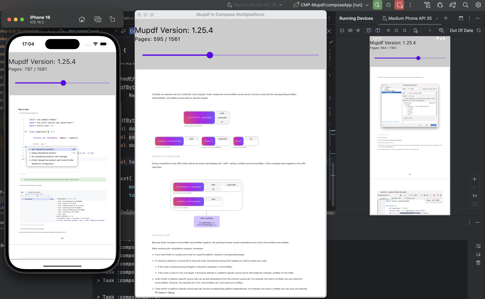

Mupdf Multiplatform

This is a Kotlin Multiplatform project targeting Android, iOS, Desktop.

[composeApp](composeApp) is for code that will be shared across your Compose Multiplatform applications.

[mupdf-android](mupdf-android)

[mupdf-ios](mupdf-ios)

[mupdf-jvm](mupdf-jvm)
[mupdf-jvm](mupdf-jvm)

